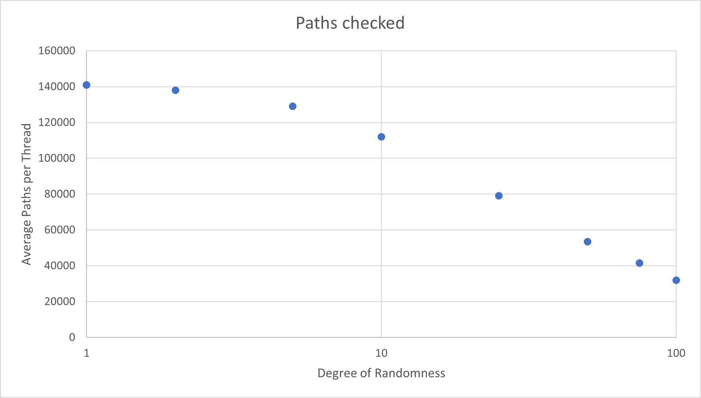
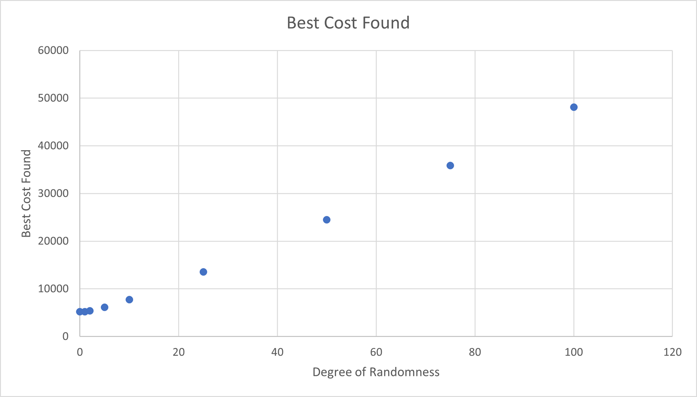

# Stochastic Nearest Neighbor TSP using MPI and OpenMP

> Adapted from a class project in High Performance Computing at the University of Tulsa.

For this project I chose to explore a stochastic variation of the Nearest Neighbor heuristic for the Traveling Salesman problem. This uses the Nearest Neighbor heuristic for this problem as normal but uses a degree of randomness to explore away from the heuristic. I hoped this would lead to exploring paths away from the Nearest Neighbor solution that would fare better than nearest neighbor.

## Methodology

To do this, I had a parameter for Degree of Randomness, which I called ODDS. This odds determined the likely hood of any individual step resorting to randomness rather than the heuristic. This, in combination with the standard nearest neighbor heuristic looks as follows:

```
Starting city = random start;
While there are unvisited cities,
	If( random chance (ODDS) )
		Randomly choose an unvisited city
	Else
		Choose the unvisited city closest to the last
```

To parallelize this, I took advantage of both MPI and OpenMP. MPI splits the work across several machines, and OpenMP splits the work among the cores of a single machine. In my implementation, the threads on each machine all do the same function, running through the above pseudocode as many times as possible within the time limit, while maintaining memory of the best path they've seen so far.

To time this system, I used the standard `<time.h>` functions, since I only needed accuracy to the second. My code checks the time at the end of every path, and if they've passed the time limit the code breaks from the loop and begins collecting results.

## Results

This implementation revealed several interesting things about the problem, including the effects of randomness upon both the quality of answer and the quantity of paths checked by the process.



What I found was that the degree of randomness greatly affected the number of paths that the process could explore. The `rand()` function in our C implementation was slow compared to the heuristic check, so running a higher degree of randomness (leaning heavily on the `rand()` function rather than the heuristic) decreased the number of paths the process could check within the time constraints. The above graph uses the average among the individual processes on each machine to measure this value.



The next thing I found was that the amount of randomness affected the quality of path found during the runtime. This actually shows that a large amount of randomness was harmful to the answer quality the process found, at anything above ODDS=5%. At and below ODDS=5%, the answers were very close to the non-random value. To explore this, I ran an experiment with large randomness but more time, to make up for the time issue that `rand()` applies to the process.

I did this by setting the ODDS to 90%, then increasing the time proportional to the gap in the number of paths checked. This resulted in multiplying the time constraint by 4 to attempt to 'even the odds' for the `rand()` function. By doing this, I was able to get the Average paths checked per process to 145,000, but the best cost path for the process was still at 43,080, more than 8 times the low randomness answer.

In conclusion, the Nearest Neighbor heuristic for the Traveling Salesman problem does not benefit from an aspect of randomness, but actually suffers to find a good path under the added randomness.
